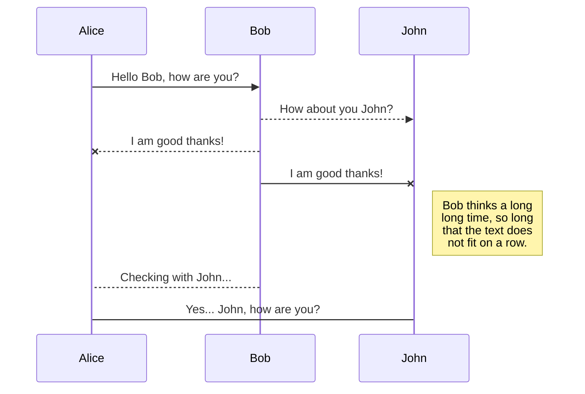
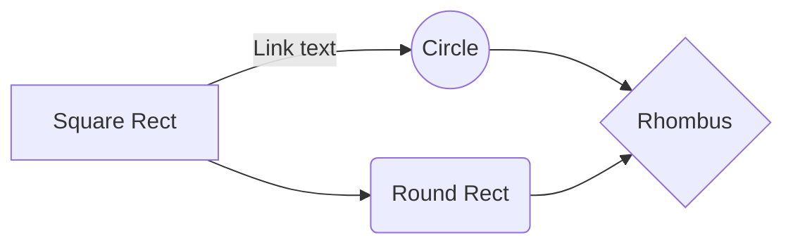

#  AI in Drug Discovery Progress

This repository contains an up-to-date list (as of September 2019) of progress (papers, github repos etc) made in applying AI to drug discovery. 

# 2019

## Retrosynthesis

|Lead Author|Group|Title|Citations|Code|
|-----------|---------|-----------------------------|-----------------|---|
|Schwaller  |`Lee`      |<a href="https://pubs.acs.org/doi/abs/10.1021/acscentsci.9b00576">Molecular Transformer: A Model for Uncertainty-Calibrated Chemical Reaction Prediction</a>       | 1 |[https://github.com/pschwllr/MolecularTransformer](https://github.com/pschwllr/MolecularTransformer)|

### Schwaller, Laino, Gaudin, Bolgar, Hunter, Bekas, Lee
#### <a href="https://pubs.acs.org/doi/abs/10.1021/acscentsci.9b00576">Molecular Transformer: A Model for Uncertainty-Calibrated Chemical Reaction Prediction</a> 
>Uses the latest cutting-edge research from the NLP community (transformer networks), viewing retrosynthesis as a machine translation problem. Word1/Molecule1 + Word2/Molecule2 ----translates_to----> Word3/Molecule3

## Generative

|Lead Author|Group|Title|Citations|Code|
|-----------|---------|-----------------------------|-----------------|---|
|Zhavoronkov|`Insilico`     |<a href="https://www.nature.com/articles/s41587-019-0224-x">Deep learning enables the rapid identification of potent DDR1 kinase inhibitors</a>           |1|[https://github.com/insilicomedicine/GENTRL](https://github.com/insilicomedicine/GENTRL)|
|Jensen     |`Jensen`            |<a href="https://pubs.rsc.org/en/content/articlelanding/2019/SC/C8SC05372C#!divAbstract">A graph-based genetic algorithm and generative model/Monte Carlo tree search for the exploration of chemical space. </a>          |-|[https://github.com/jensengroup/GB-GA](https://github.com/jensengroup/GB-GA)|

### Zhavoronkov et al
#### [Deep learning enables the rapid identification of potent DDR1 kinase inhibitors](https://www.nature.com/articles/s41587-019-0224-x)
> This paper sparked much public press. Uses deep RL to optimize for properties in an GRU-encoded latent space.

### Jensen
#### [A graph-based genetic algorithm and generative model/Monte Carlo tree search for the exploration of chemical space. ](https://pubs.rsc.org/en/content/articlelanding/2019/SC/C8SC05372C#!divAbstract)

## Predictive

|Lead Author|Group|Title|Citations|Code|
|-----------|---------|-------------------------------|-----------------|---|
|Cortes-Ciriano  |`Bender`      | <a href="https://jcheminf.biomedcentral.com/articles/10.1186/s13321-019-0364-5">KekuleScope: prediction of cancer cell line sensitivity and compound potency using convolutional neural networks trained on compound images</a>    |      | <a href="https://github.com/isidroc/kekulescope/blob/master/Kekulescope.py">Yes</a> |
### Cortes-Ciriano, Bender
#### [ KekuleScope: prediction of cancer cell line sensitivity and compound potency using convolutional neural networks trained on compound images](https://jcheminf.biomedcentral.com/articles/10.1186/s13321-019-0364-5)
> Using modern CNN architectures and transfer learning from ImageNet to predict activity from RDKit-rendered skeletal structures of the ligand.
[https://github.com/isidroc/kekulescope/blob/master/Kekulescope.py](https://github.com/isidroc/kekulescope/blob/master/Kekulescope.py)|

# 2018
## Generative

### Segler et al.
#### [Generating Focused Molecule Libraries for Drug Discovery with Recurrent Neural Networks](https://pubs.acs.org/doi/10.1021/acscentsci.7b00512)

# 2017

# 2016

## Review
### Cortes-Ciriano, Mervin, Bender
#### [Current Trends in Drug Sensitivity Prediction](http://www.eurekaselect.com/146734/article)

## Predictive
### Lee, Brenner, Colwell

#### <a href="https://www.pnas.org/content/113/48/13564.short">Predicting protein-ligand affinity with a random matrix framework</a>

# 2015

## Generative
|Lead Author|Group|Title|Citations|Code|
|-----------|---------|-------------------------------|-----------------|---|
|Bombarelli  |`Aspuru-Guzik`      | <a href="https://pubs.acs.org/doi/full/10.1021/acscentsci.7b00572#targetText=Continuous%20representations%20of%20molecules%20allow,structures%2C%20or%20interpolating%20between%20molecules.">Automatic Chemical Design Using a Data-Driven Continuous Representation of Molecules</a>    |   410   | <a href="https://github.com/aspuru-guzik-group/chemical_vae">Yes</a> |

## Predictive

|Lead Author|Group|Title|Citations|Code|
|-----------|---------|-------------------------------|-----------------|---|
|Ma  |`Sheridan`      | <a href="https://pubs.acs.org/doi/10.1021/ci500747n">Deep Neural Nets as a Method for Quantitatitve Structure-Activity Relationships</a>    |   410   | <a href="https://github.com/aspuru-guzik-group/chemical_vae">Yes</a> |
|Wallach  |`Atomwise`      | <a href="https://pubs.acs.org/doi/full/10.1021/acscentsci.7b00572#targetText=Continuous%20representations%20of%20molecules%20allow,structures%2C%20or%20interpolating%20between%20molecules.">Automatic Chemical Design Using a Data-Driven Continuous Representation of Molecules</a>    |   410   | <a href="https://github.com/aspuru-guzik-group/chemical_vae">Yes</a> |
|Duvenaud  |`Aspuru-Guzik/Adams`      | <a href="https://pubs.acs.org/doi/full/10.1021/acscentsci.7b00572#targetText=Continuous%20representations%20of%20molecules%20allow,structures%2C%20or%20interpolating%20between%20molecules.">Automatic Chemical Design Using a Data-Driven Continuous Representation of Molecules</a>    |   410   | <a href="https://github.com/aspuru-guzik-group/chemical_vae">Yes</a> |
|Ramsundar  |`Google/Pande`      | <a href="https://pubs.acs.org/doi/full/10.1021/acscentsci.7b00572#targetText=Continuous%20representations%20of%20molecules%20allow,structures%2C%20or%20interpolating%20between%20molecules.">Automatic Chemical Design Using a Data-Driven Continuous Representation of Molecules</a>    |   410   | <a href="https://github.com/aspuru-guzik-group/chemical_vae">Yes</a> |
### Ma, Sheridan, Liaw, Dahl, Svetnik

#### [Deep Neural Nets as a Method for Quantitatitve Structure-Activity Relationships](https://pubs.acs.org/doi/10.1021/ci500747n)

> Follow-up paper to the Merck Kaggle challenge, which was won by a researcher in Hinton's lab. One of the first examples of the pushing of deep learning into the limelight for drug discovery.

### Wallach, Dzamba, Heifets

#### [AtomNet: A Deep Convolutional Neural Network for Bioactivity Prediction in Structure-based Drug Discovery](https://arxiv.org/abs/1510.02855)

> First known example of CNNs being applied to ligand-based drug discovery in the literature.

### Duvenaud, Maclaurin, Aguilera-Iparraguirre, Gomez-Bombarelli, Aspuru-Guzik, Adams

#### [Convolutional Networks on Graphs for Learning Molecular Fingerprints](http://papers.nips.cc/paper/5954-convolutional-networks-on-graphs-for-learning-molecular-fingerprints)

>First example of elucidating the potential of graph convolutions on molecules.

### Ramsundar, Kearnes, Riley
#### [Massively Multitask Networks for Drug Discovery](https://arxiv.org/abs/1502.02072)

> Using a shared representation of hundreds of thousands of molecules to predict activity at multiple targets simultaneously.

# 2014

# 2013

# 2012

## General
### Bickerton, Paolini, Besnard, Muresan, Hopkins
#### [Quantifying the chemical beauty of drugs](https://www.nature.com/articles/nchem.1243)
> Introduction of a metric to assess general drug-likeness based on modelling probability distributions for Lipinski's 5 paramters using a curated set of orally active pharmaceuticals.

## Predictive
### Chen, Sheridan, Hornak, Voigt
#### [Comparison of Random Forest and Pipeline Pilot Naïve Bayes in Prospective QSAR Predictions](https://pubs.acs.org/doi/10.1021/ci200615h)

# 2011 

# 2010
### Rogers, Hahn
#### [Extended-connectivity fingerprints](https://pubs.acs.org/doi/10.1021/ci100050t)

## Create files and folders

The file explorer is accessible using the button in left corner of the navigation bar. You can create a new file by clicking the **New file** button in the file explorer. You can also create folders by clicking the **New folder** button.

## Switch to another file

All your files and folders are presented as a tree in the file explorer. You can switch from one to another by clicking a file in the tree.

## Rename a file

You can rename the current file by clicking the file name in the navigation bar or by clicking the **Rename** button in the file explorer.

## Delete a file

You can delete the current file by clicking the **Remove** button in the file explorer. The file will be moved into the **Trash** folder and automatically deleted after 7 days of inactivity.

## Export a file

You can export the current file by clicking **Export to disk** in the menu. You can choose to export the file as plain Markdown, as HTML using a Handlebars template or as a PDF.

# Synchronization

Synchronization is one of the biggest features of StackEdit. It enables you to synchronize any file in your workspace with other files stored in your **Google Drive**, your **Dropbox** and your **GitHub** accounts. This allows you to keep writing on other devices, collaborate with people you share the file with, integrate easily into your workflow... The synchronization mechanism takes place every minute in the background, downloading, merging, and uploading file modifications.

There are two types of synchronization and they can complement each other:

- The workspace synchronization will sync all your files, folders and settings automatically. This will allow you to fetch your workspace on any other device.
	> To start syncing your workspace, just sign in with Google in the menu.

- The file synchronization will keep one file of the workspace synced with one or multiple files in **Google Drive**, **Dropbox** or **GitHub**.
	> Before starting to sync files, you must link an account in the **Synchronize** sub-menu.

## Open a file

You can open a file from **Google Drive**, **Dropbox** or **GitHub** by opening the **Synchronize** sub-menu and clicking **Open from**. Once opened in the workspace, any modification in the file will be automatically synced.

## Save a file

You can save any file of the workspace to **Google Drive**, **Dropbox** or **GitHub** by opening the **Synchronize** sub-menu and clicking **Save on**. Even if a file in the workspace is already synced, you can save it to another location. StackEdit can sync one file with multiple locations and accounts.

## Synchronize a file

Once your file is linked to a synchronized location, StackEdit will periodically synchronize it by downloading/uploading any modification. A merge will be performed if necessary and conflicts will be resolved.

If you just have modified your file and you want to force syncing, click the **Synchronize now** button in the navigation bar.

> **Note:** The **Synchronize now** button is disabled if you have no file to synchronize.

## Manage file synchronization

Since one file can be synced with multiple locations, you can list and manage synchronized locations by clicking **File synchronization** in the **Synchronize** sub-menu. This allows you to list and remove synchronized locations that are linked to your file.

# Publication

Publishing in StackEdit makes it simple for you to publish online your files. Once you're happy with a file, you can publish it to different hosting platforms like **Blogger**, **Dropbox**, **Gist**, **GitHub**, **Google Drive**, **WordPress** and **Zendesk**. With [Handlebars templates](http://handlebarsjs.com/), you have full control over what you export.

> Before starting to publish, you must link an account in the **Publish** sub-menu.

## Publish a File

You can publish your file by opening the **Publish** sub-menu and by clicking **Publish to**. For some locations, you can choose between the following formats:

- Markdown: publish the Markdown text on a website that can interpret it (**GitHub** for instance),
- HTML: publish the file converted to HTML via a Handlebars template (on a blog for example).

## Update a publication

After publishing, StackEdit keeps your file linked to that publication which makes it easy for you to re-publish it. Once you have modified your file and you want to update your publication, click on the **Publish now** button in the navigation bar.

> **Note:** The **Publish now** button is disabled if your file has not been published yet.

## Manage file publication

Since one file can be published to multiple locations, you can list and manage publish locations by clicking **File publication** in the **Publish** sub-menu. This allows you to list and remove publication locations that are linked to your file.

# Markdown extensions

StackEdit extends the standard Markdown syntax by adding extra **Markdown extensions**, providing you with some nice features.

> **ProTip:** You can disable any **Markdown extension** in the **File properties** dialog.

## Table

SmartyPants converts ASCII punctuation characters into "smart" typographic punctuation HTML entities. For example:

|       Lead Author | Group   |Title                          |Citations  |Code                       |
|----------------|-------------------------------|-----------------------------|-----------------|---|
|Bender|`'Isn't this fun?'`            |'Isn't this fun?'            |asdfds|asfasdsadfasdf|
|Quotes          |`"Isn't this fun?"`            |"Isn't this fun?"            |
|Dashes          |`-- is en-dash, --- is em-dash`|-- is en-dash, --- is em-dash|

## KaTeX

You can render LaTeX mathematical expressions using [KaTeX](https://khan.github.io/KaTeX/):

The *Gamma function* satisfying $\Gamma(n) = (n-1)!\quad\forall n\in\mathbb N$ is via the Euler integral

$$
\Gamma(z) = \int_0^\infty t^{z-1}e^{-t}dt\,.
$$

> You can find more information about **LaTeX** mathematical expressions [here](http://meta.math.stackexchange.com/questions/5020/mathjax-basic-tutorial-and-quick-reference).

## UML diagrams

You can render UML diagrams using [Mermaid](https://mermaidjs.github.io/). For example, this will produce a sequence diagram:

And this will produce a flow chart:

